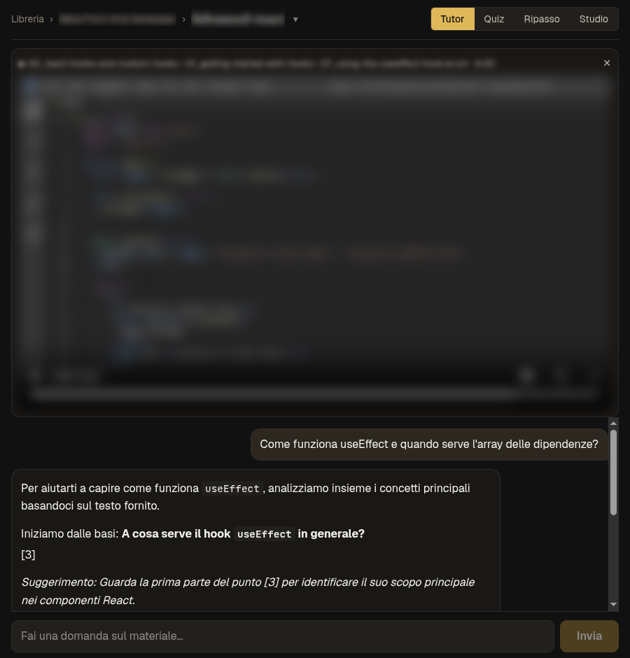
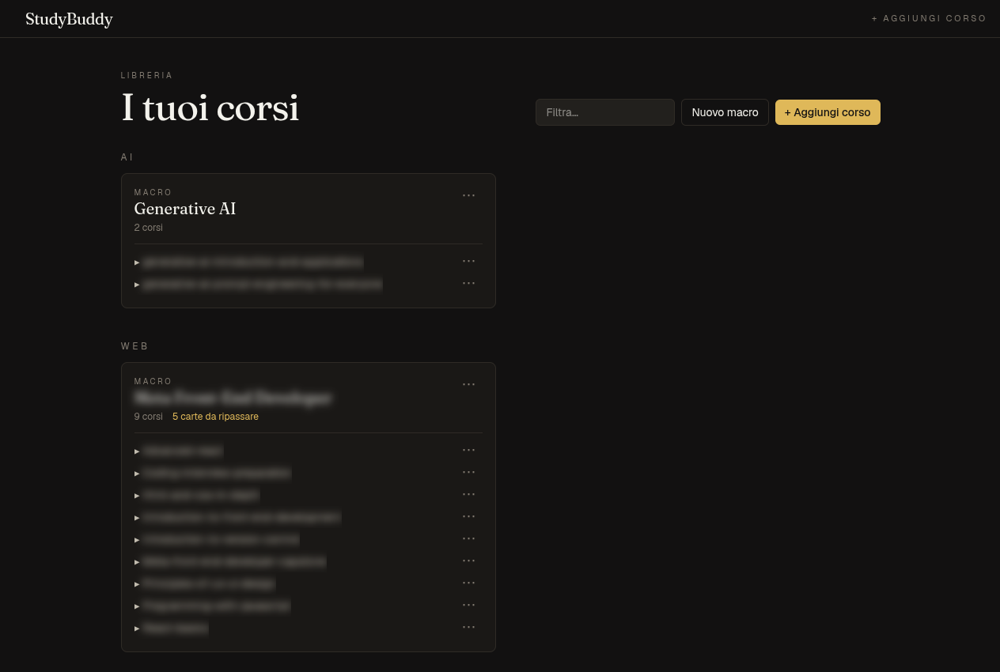
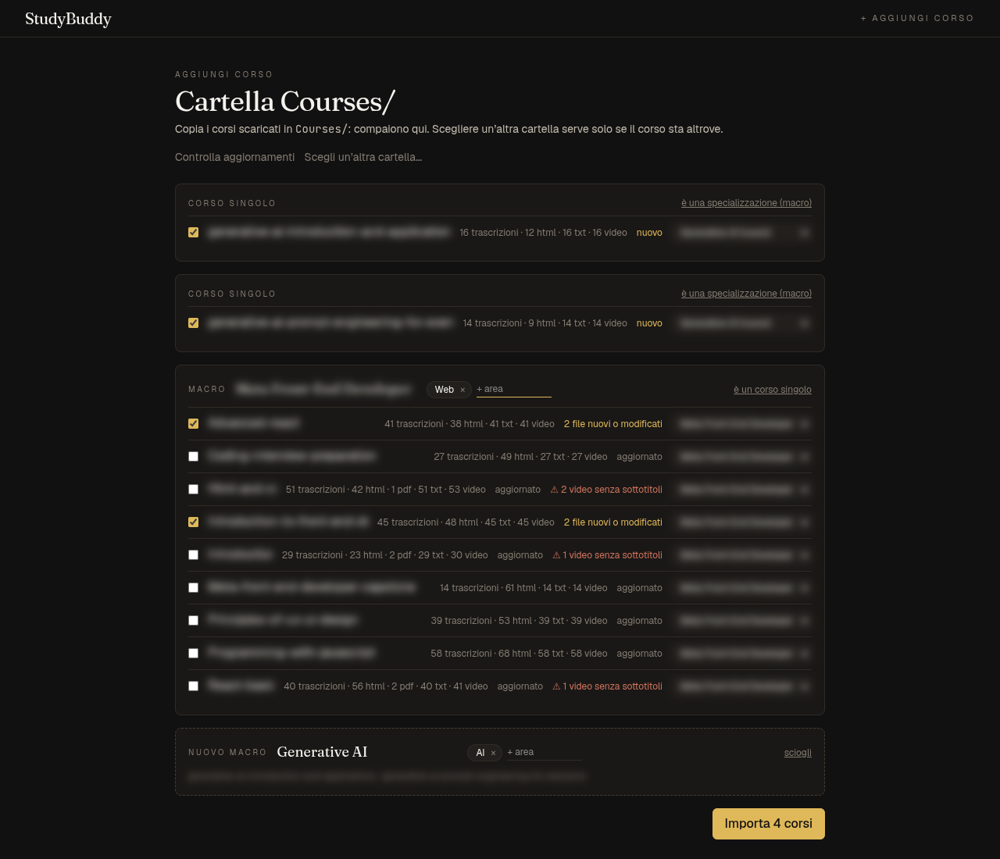
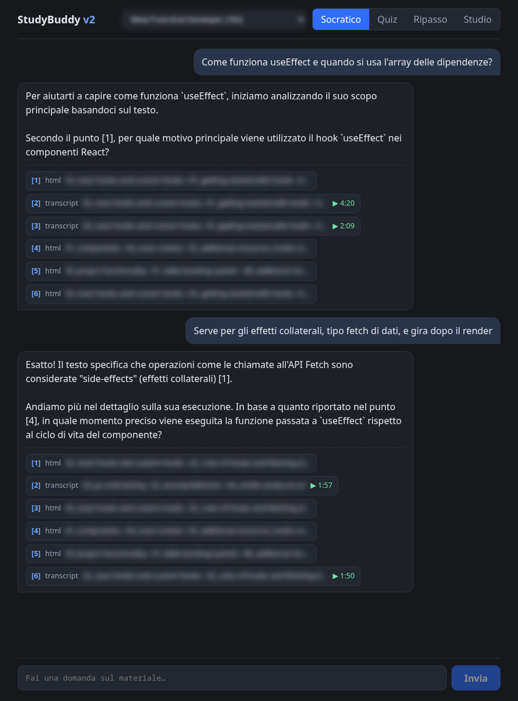
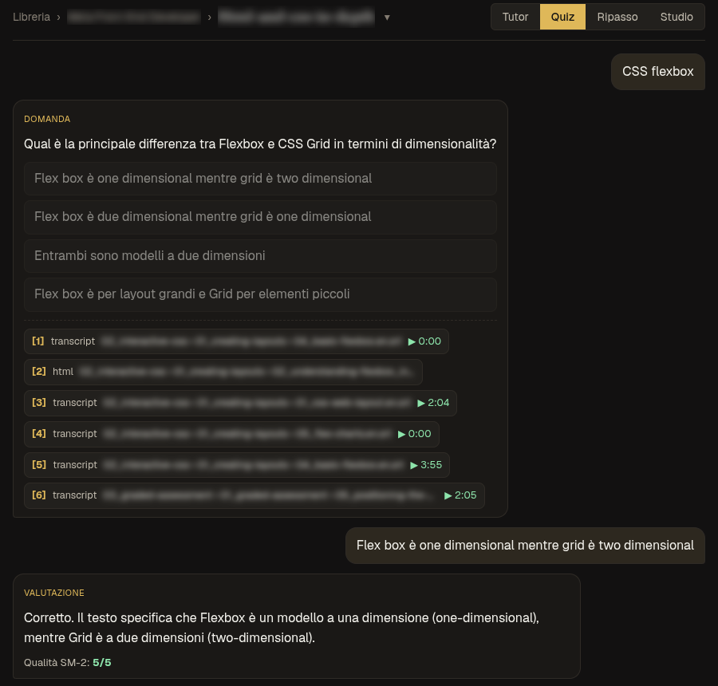
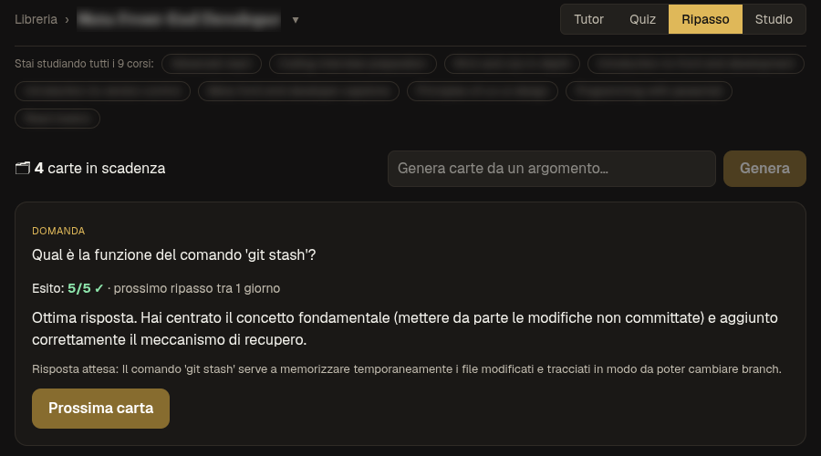
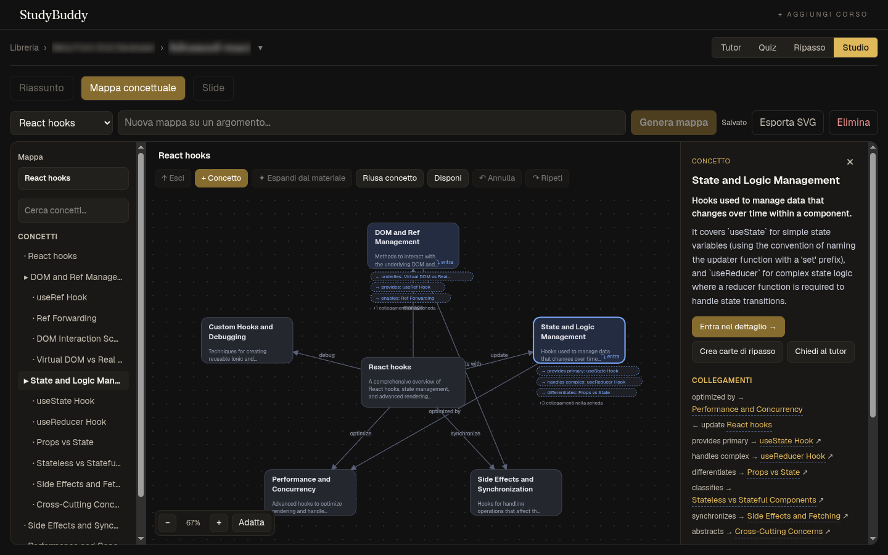
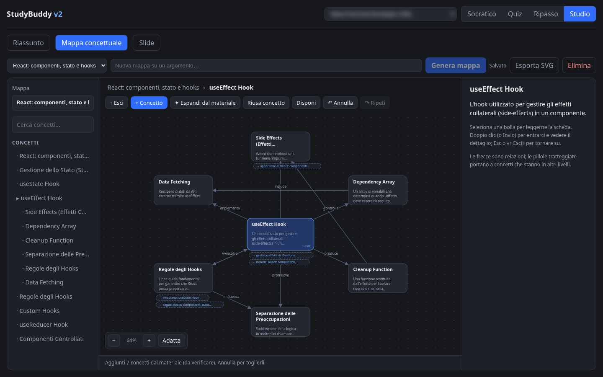
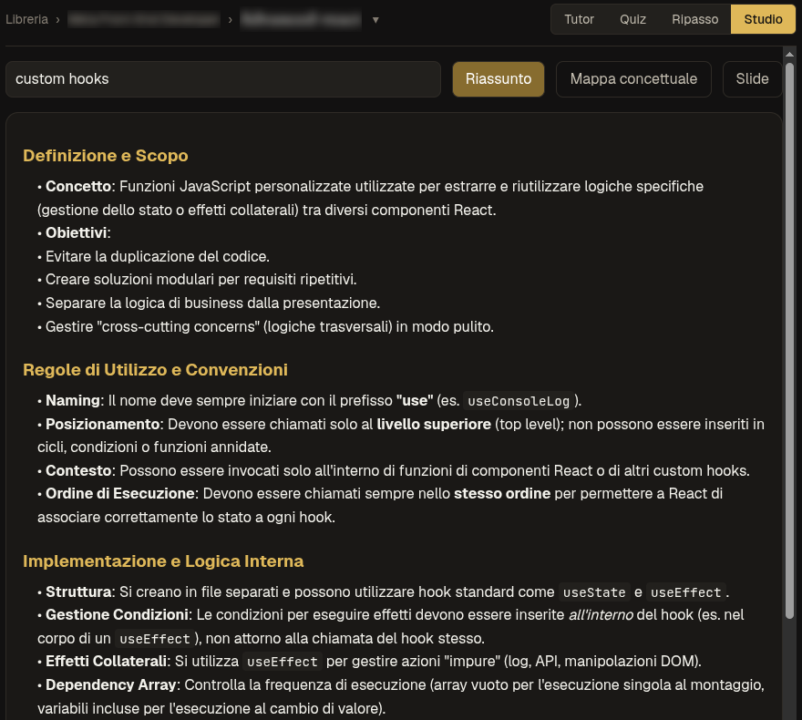
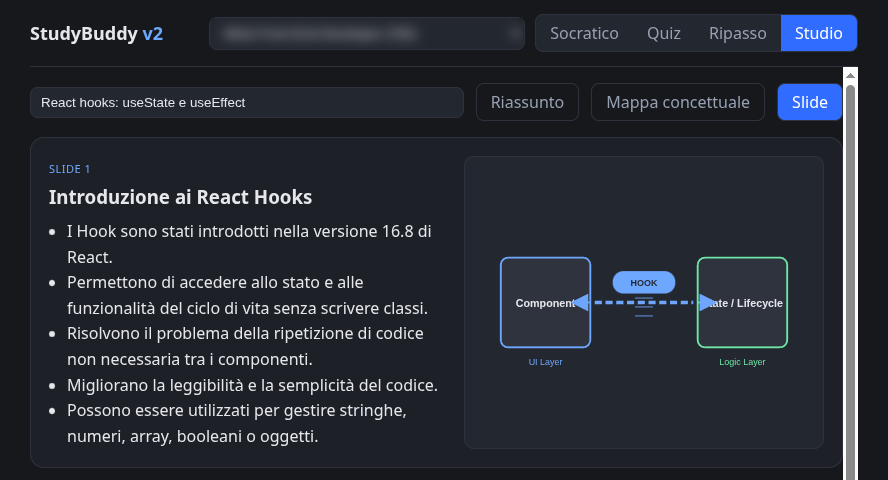

# StudyBuddy v2

**A local-first AI study companion.** Drop downloaded online courses (video transcripts, PDFs, HTML readings) into a folder, import them from the app, and each one becomes a personal tutor. It answers Socratically and cites the exact minute of the lecture video. It also generates quizzes and spaced-repetition flashcards, map-reduce summaries, slides, and explorable concept maps. Everything runs on your machine through Ollama, so no data leaves it and there is no per-token bill.



> Rebuild of [StudyBuddy v1](https://github.com/Federico-Ordonselli/studybuddy) (Python + Streamlit + ChromaDB) on a modular TypeScript stack, with hybrid retrieval, a real cross-encoder reranker, and a new UI.

## Features

### Course library and guided import
Copy downloaded courses into `Courses/` and the library notices them. **Add course** analyses the folder without touching the database. It tells a specialization (named sub-folders, one course each) from a single course (numbered module folders), counts transcripts, PDFs, HTML and videos, flags videos without subtitles, and compares file hashes with the last import to mark each course *new*, *up to date* or *changed*. You review an editable preview before anything is written: rename, flip course ↔ specialization, group loose courses into a new one, assign **domains**, and pick what to import. Import runs in the background with per-course progress.

Domains group your courses in the library; create, rename, reorder and delete them in **Settings**, which also shows whether the database, Ollama, the GPU reranker and Whisper are working. A personal home shows what's due today, the courses you were studying and your inbox. Press **n** anywhere to jot a note: it lands on the course you're studying, the domain you're browsing, or the inbox, and you can move it later.

The hierarchy is two levels deep: studying a specialization covers all its courses (retrieval, review queue, maps). Domains are organization-only: they group the library at a glance without mixing content. Re-importing never undoes manual organization.

 

### Socratic tutor with video-timestamp citations
Ask a question, even in Italian about English material, about one course or a whole specialization. The tutor doesn't hand you the answer. It guides you with questions and hints, and it relies **only** on passages retrieved from the course. Every answer lists numbered sources. A transcript citation opens the built-in player at the exact timestamp. Conversations are saved and resumed.



### Quizzes graded by an LLM judge
Pick a topic and you get a multiple-choice question generated with structured output (a JSON schema enforced on the model). Answers are graded 0–5 by an LLM-as-judge prompt, with an explanation grounded in the course text.



### Spaced repetition (SM-2)
Flashcards are generated from a topic or from a concept-map node. You answer in your own words, the LLM grades the answer, and **SM-2** schedules the next review. An invalid grade throws instead of recording a 0, which would reset a card you already know.



### Explorable concept maps
The model proposes a central concept, related concepts, and labelled relations. Each concept comes with a definition, an explanation, examples, and **sources**. Double-click a bubble to **enter** it (animated zoom). The first time, the sub-level is generated from the material, reusing titles already on the map. This creates cross-level links (dashed "portal" pills) instead of duplicate nodes. Every AI proposal is applied as atomic commands, so undo/redo works on AI edits too.




### Summaries and slides
Map-reduce summaries over a topic or a whole module. The slides come with SVG illustrations drawn locally by the LLM; the image backend is pluggable (AUTOMATIC1111 or an image API).

 

## How it works

```
 Course folder (course/module/lesson/)        Ingestion
  .srt/.vtt ─► subtitle parser (timestamps) ─┐  ┌─────────────────────────────────────┐
  .pdf      ─► unpdf (pdf.js, no native deps)┼─►│ chunking + breadcrumb + timestamps  │
  .html     ─► node-html-parser              │  │ per-file hash → idempotent re-ingest│
  .mp4 w/o subtitles ─► Whisper sidecar ─────┘  │ dedup of twin sources / chunks      │
                                                └──────────────────┬──────────────────┘
                                                                   ▼
                                SQLite: documents · chunks · sqlite-vec · FTS5
                                                                   │
 Question ─► dense (sqlite-vec) ─┐                                 │
          └► BM25 (FTS5)       ──┴─► RRF fusion ─► cross-encoder (GPU) ─► top 6
                                                                   │
                        generate(task) ─► Ollama (or opt-in API) ◄─┘
                                                                   │
           Socratic tutor · Quiz · Grading · SM-2 · Summaries · Slides · Concept maps
```

- **Hybrid retrieval.** Dense search alone misses exact terms (`useEffect`, `git rebase`). Lexical search alone can't match an Italian question to English material. StudyBuddy runs both: multilingual `qwen3-embedding` on **sqlite-vec** and **BM25** on FTS5. It fuses them with **Reciprocal Rank Fusion**, which merges by rank, so incomparable cosine and BM25 scores never need normalizing.
- **Real reranker.** `bge-reranker-v2-m3` runs in-process via Transformers.js / ONNX Runtime on CUDA (fp16, ~0.6 s for 20 passages). If CUDA isn't available it falls back to CPU (q8, ~3.4 s); if the model fails to load, it falls back to LLM listwise reranking.
- **Provider-agnostic.** Every LLM call goes through `generate(task, opts)` / `embed(texts)`. `src/lib/config.ts` maps each task (chat, quiz, grade, summarize, embed, rerank) to a provider and model. Ollama is the default; Anthropic or any OpenAI-compatible endpoint is opt-in **per task**.
- **Safe for a local app that touches the filesystem.** `src/proxy.ts` only accepts local `Host` headers, which blocks DNS rebinding, and only `application/json` writes, which forces a CORS preflight against CSRF. Client paths go through a home-directory sandbox that is checked on the *real* path, so a symlink pointing outside it is skipped and reported. The video endpoint only streams files that were actually ingested.

## Stack

Next.js 16 (App Router, Turbopack) · React 19 · TypeScript 7 · SQLite + Drizzle ORM · sqlite-vec · FTS5 · Ollama · Transformers.js / onnxruntime-node · unpdf · node-html-parser · faster-whisper (optional)

Default models, chosen with a small bake-off on tutoring, quiz generation and grading. They fit together in 16 GB of VRAM:

| Task | Model |
|---|---|
| chat, quiz, grade, summarize | `gemma4:12b` |
| embeddings (1024-d, multilingual) | `qwen3-embedding:0.6b` |
| rerank | `onnx-community/bge-reranker-v2-m3-ONNX` |

## Setup

Requirements: Node.js ≥ 22, [Ollama](https://ollama.com) ≥ 0.35, ~10 GB of VRAM recommended (CPU works, slowly).

```bash
ollama pull gemma4:12b
ollama pull qwen3-embedding:0.6b

npm install
echo "DB_PATH=studybuddy.db" > .env.local
npm run dev                                          # http://localhost:3000 (a new database is created on first start)
```

The reranker model downloads into `.models/` on first use. The vector and full-text tables (`sqlite-vec`, FTS5) are created by the app, so don't run `drizzle-kit push` on a database that already has data: they aren't part of the Drizzle schema.

**GPU reranking** uses `onnxruntime-node` 1.30, which runs on the system CUDA 13 libraries. Without a usable GPU it falls back to CPU.

**Optional Whisper fallback** for videos without subtitles: `.venv/bin/pip install faster-whisper`, plus the CUDA 12 libraries for GPU transcription (whisper.cpp and openai-whisper are auto-detected too):

```bash
python -m venv .venv
.venv/bin/pip install faster-whisper nvidia-cublas-cu12 nvidia-cudnn-cu12
```

The CUDA 12 libraries in `.venv` are added to `LD_LIBRARY_PATH` of the Whisper subprocess only (`src/lib/transcribe.ts`), never of the Node process: the reranker keeps using the system CUDA 13 and cuDNN. Without them Whisper falls back to CPU; the reranker still uses the GPU.

## Run with Docker (GPU)

Requirements: Docker with the NVIDIA Container Toolkit, and [Ollama](https://ollama.com) running on the host with the models in `src/lib/config.ts` pulled.

```bash
mkdir -p data
cp .env.example .env        # set COURSES_DIR to the absolute path of your courses folder
docker compose up -d --build
```

Open http://localhost:3000. Courses are mounted read-only at the same path as on the host; the database and model caches live in `./data`. Check the setup at http://localhost:3000/api/health (`?warm=1` loads the reranker, runs one test inference and reports `cuda` or `cpu`). Set `STUDYBUDDY_PORT` / `STUDYBUDDY_HOST` in `.env` to change the port or bind address.

No GPU: `docker compose -f docker-compose.yml -f compose.cpu.yaml up -d --build` (reranker and Whisper fall back to CPU).

## Adding courses

1. Copy each downloaded course (or a whole specialization) into `Courses/` in the project root. Set `STUDYBUDDY_LIBRARY_DIR` to use another folder inside your home.
2. Open the app: the library shows a banner with the new folders. Click **Add course**, check the preview, import.
3. **Check for updates** on the same page re-hashes the files and re-imports only what changed.

The expected layout is `course/module/lesson/` with mixed files. Subtitles are the primary source (`lesson.en.srt` covers `lesson.mp4`). Videos are skipped, but their paths are kept so citations can link to them. Videos without subtitles can be transcribed with Whisper from the preview (slow: minutes per hour of video).

Re-importing is idempotent: unchanged files are skipped by hash, modified files are replaced, and names, specializations and domains you changed by hand are kept.

There is also a CLI, which follows the same rules:

```bash
npm run ingest -- "path/to/course" "Course name"
npm run ingest -- "path/to/course" "Course name" --whisper   # also transcribe videos without subtitles
```

## Migrating from learning-vault

StudyBuddy absorbs learning-vault, the earlier personal hub: its domains, notes and Street Fighter 6 data move into a **new** database. Nothing is modified in place. The script reads a copy of the vault database, including its WAL, and makes an online backup of yours.

```bash
npm run import-vault -- --vault ~/learning-vault --target data/studybuddy.db            # dry run: prints the plan, writes nothing
npm run import-vault -- --vault ~/learning-vault --target data/studybuddy.db --apply    # creates data/studybuddy.db
```

- A vault domain with the same slug or name as one of your domains is merged into it: symbol and tagline come from the vault, the name stays yours.
- `--skip <slug>` leaves a domain out, and its notes go to the inbox.
- The vault's settings are not copied. A Groq key, if you had one, belongs in `.env` as `GROQ_API_KEY`.
- The database source defaults to `DB_PATH` from `.env.local` (`--from` to override).
- `data/studybuddy.db` is what Docker uses.

## Project structure

```
src/lib/
  config.ts        model-per-task routing, RAG / reranker / Whisper settings
  library.ts       library tree, invariants (2 levels: specialization → courses), domains
  areas.ts         domains (create, rename, reorder, delete) and their invariants
  notes.ts         notes: inbox, domain or course
  home.ts          home ("today") and sidebar data
  vaultImport/     learning-vault import: read a WAL-safe copy, plan (merge/new/skip), apply with count checks
  ingestPlan.ts    read-only folder analysis: course vs specialization, file counts, change detection
  ingestTree.ts    applies an import plan to the library, then ingests course by course
  providers/       ollama | anthropic | openai-compatible | image backends
  rag/             chunking, sqlite-vec + FTS5 store, hybrid search, rerank, course parsers
  tutor/           socratic session, quiz, grading, SM-2 cards
  mappe/           concept-map core (format, atomic commands, undo/redo, LLM proposals)
  conceptmap.ts    map generation and "enter a concept" expansion
  summarize.ts     map-reduce summaries
  slides.ts        slide decks
src/app/                pages: / (home), /corsi (library), /corsi/add (import), /d/[slug] (domain), /study/[id]?mode=tutor|quiz|review|studio, /settings
src/components/shell/   sidebar, mobile drawer, quick capture shortcut
src/components/mappe/   SVG canvas and editor (framework-free DOM, hosted in React)
src/app/api/            thin route handlers
src/proxy.ts            host allowlist + JSON-only writes
```

## Tests

```bash
npm test          # node:test via tsx, temporary SQLite database per file, no Ollama needed
npm run typecheck
```

## Limitations

- Single-user and local-only by design: no auth, no sync.
- SVG illustrations from a 12B model are simple and sometimes imprecise.
- Quiz options sometimes reuse the English wording of the source material.

Screenshots show real output generated locally on purchased online courses. Video frames, course names and file paths are blurred. No course material is included in this repository.

## License

[MIT](LICENSE), except the concept-map engine (`src/components/mappe/*.js|*.css`, `src/lib/mappe/*.js`), which is derived from a separate project and remains under the [PolyForm Noncommercial License 1.0.0](src/components/mappe/LICENSE). See [NOTICE](NOTICE).
